# Configuration
In order to run this application you need to install the following

python 3.7               use pip install python
django
pillow library               pip install pillow

then use one of the following
visual studio ide
vs code

or search on google how to run django web app on whatever ide you got

The database schema is found in db.sqlite3 you can open and access it using and sqlreader, howver a pdf called db_scheme.pdf is provided

The following is the link to github repository in case you faced any issue you can clone the whole project from there
	https://github.com/MohamedGira/HospitalHub

And this link is fast demo run-through the app
	https://drive.google.com/drive/folders/1qt95uxJ7CHSFqvySQHkgY7QMpBx4HI_a

# Hospital Hub

This guide is meant to the different kinds of users to our app
(patients, doctors, admins, and owners)\
it will take you through each user system revealing the how-to-use
methods and revealing all the features

The following URLs are provided to navigate between the different
subsystems, once you enter any system, all the navigations within are
done through buttons. To enter one if the systems insert one of these
URLS the URL that will be provided by the IDE after running the server.

| **URL** | **Destination** |
| --- | --- |
| **/h/** | The home page |
| **/h/l** | Login as doctor or patient (can be done by buttons in the home page) |
| **/h/a** | Sign in as admin |
| **/h/o** | Sign in as user |
| **\* Note that most of login pages will redirect you to your account home page if you are already signed in, so you should logout before trying to login with a different user** |
| **\* Note: the rest of the URLS can be found in HospitalHub/hospital\_hub/urls.py file, though they won&#39;t be needed** |
| **\* Note: if you want to have a full test case experience you can start by creating an owner from /h/owner/register (Note: no need as already registers account will be provided by the end of this section)** |

### Home page

This is the first tab the patient deal with even without login or
registration where he/she can preview:

1.  The available hospitals

2.  Specializations

3.  Doctors

They can as well search any doctor, hospital, or speciality through the
search bar

---

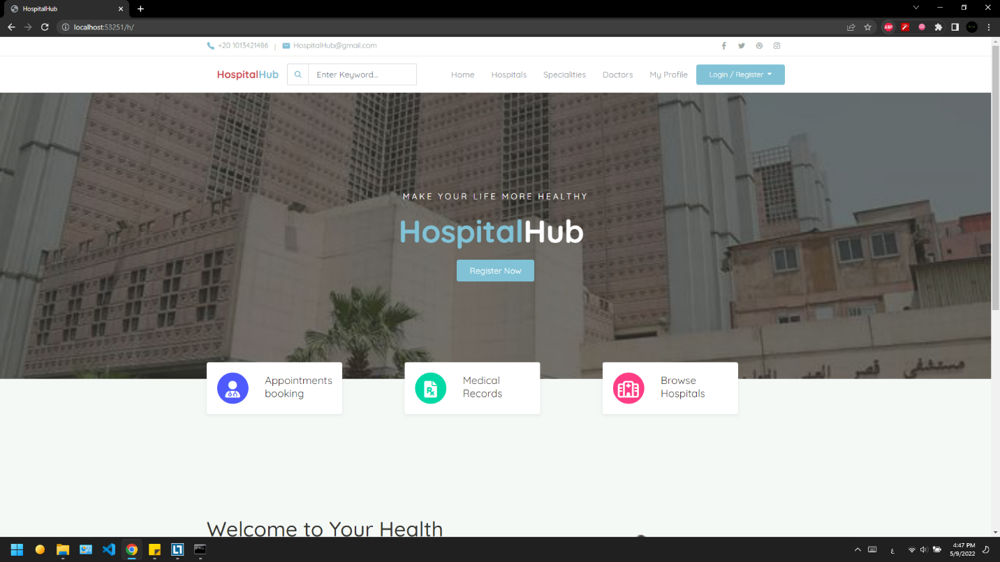

---

1.  Available hospitals

> At this page the patient can preview the hospitals and can open a link
> to the hospital where he/ she can see the specializations and the
> doctors in this hospital.

---

---

2.  Specialities\
    The patient can search for each specialization by its name in the
    key search above and can preview the doctors in these
    specializations.

---

---

3.  Doctors

---

---

Patients can view doctors' profiles as shown below, on this page they
can do the following:

1.  Add review (only if there were prior visits.)

2.  View schedule and book appointment in the day and date of their
    choice

3.  See others' reviews on that doctor and his overall review

---

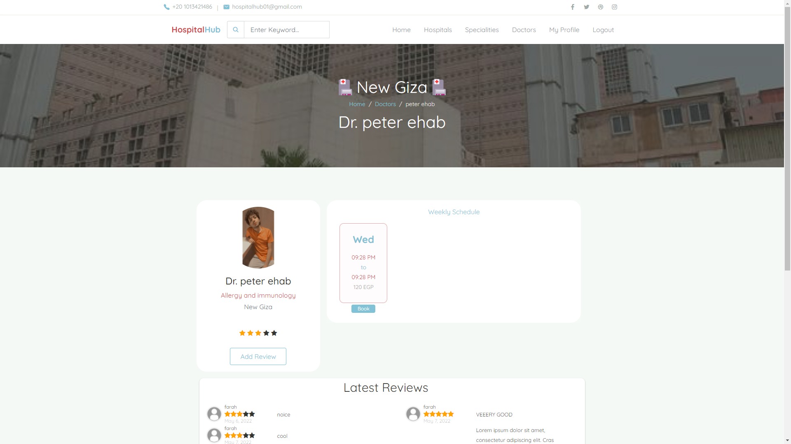

---

1.  Adding review

---

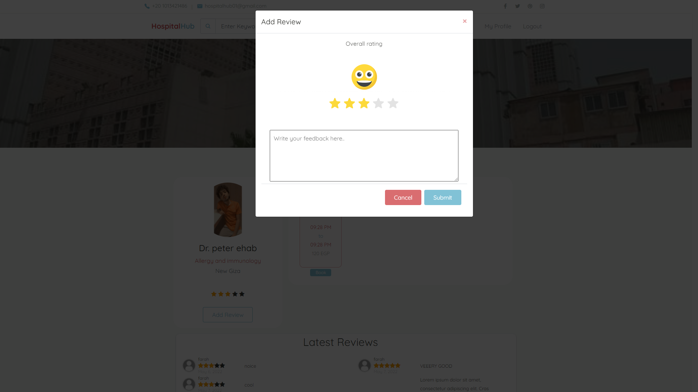

---

2.  Booking appointment

---

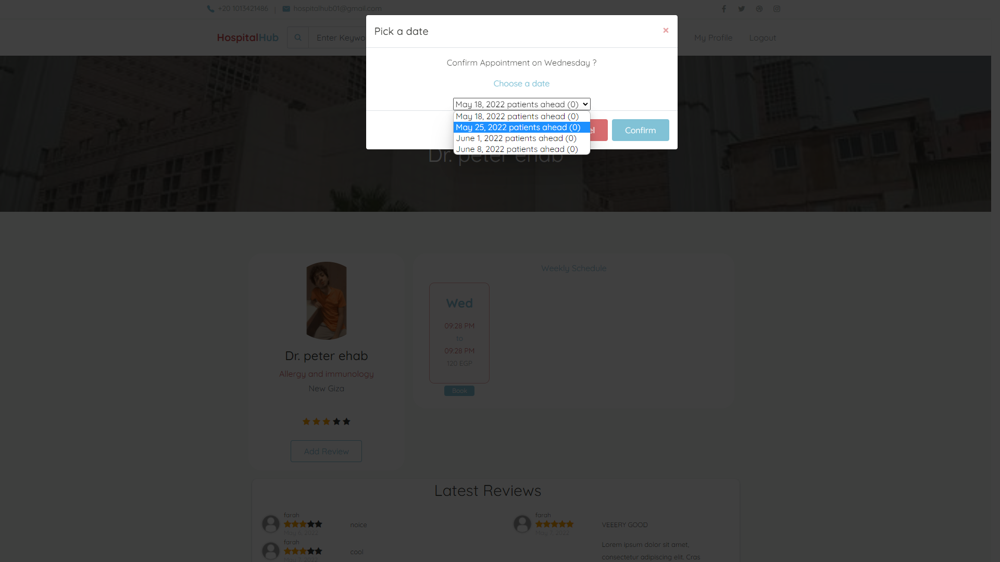

---

3.  See latest reviews

---

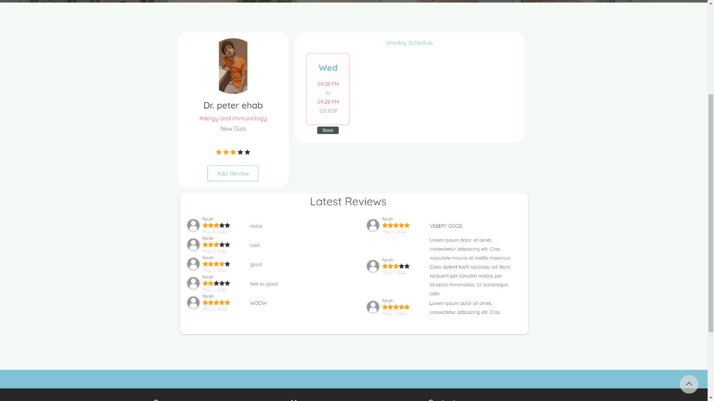

---

Patients can also view their profile, in there, they can view their
medical history, all prior visits along with diagnosis, prescriptions,
and they can also submit test results via clicking the test name, and
they view and download old visits documents

---

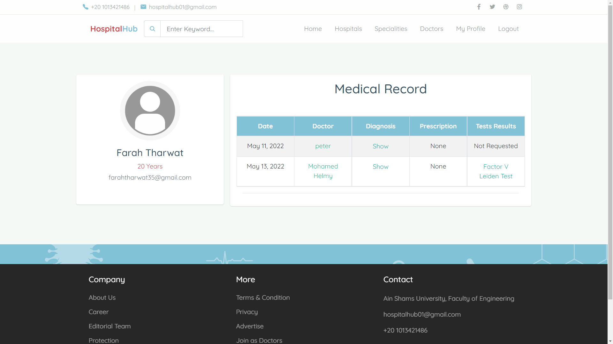

---

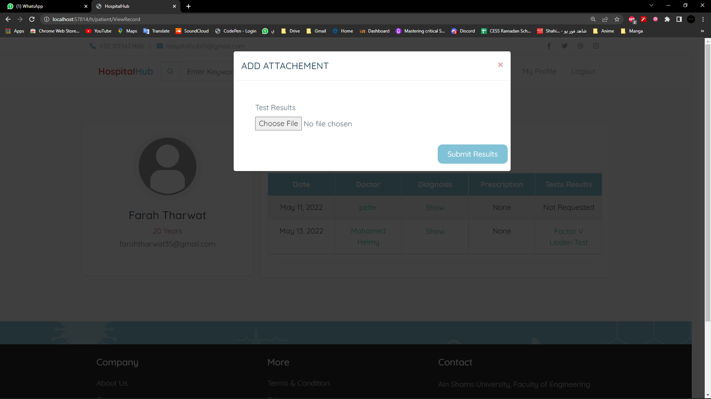

---

### Doctors

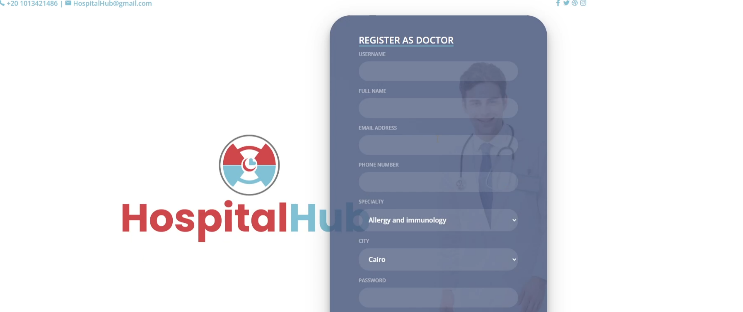 The doctor can register with his
credentials and can sign in with these credentials to perform his/her
duties if they are enrolled in any.

You can see that the doctor can view the patients' appointments with
their medical history and medical records.

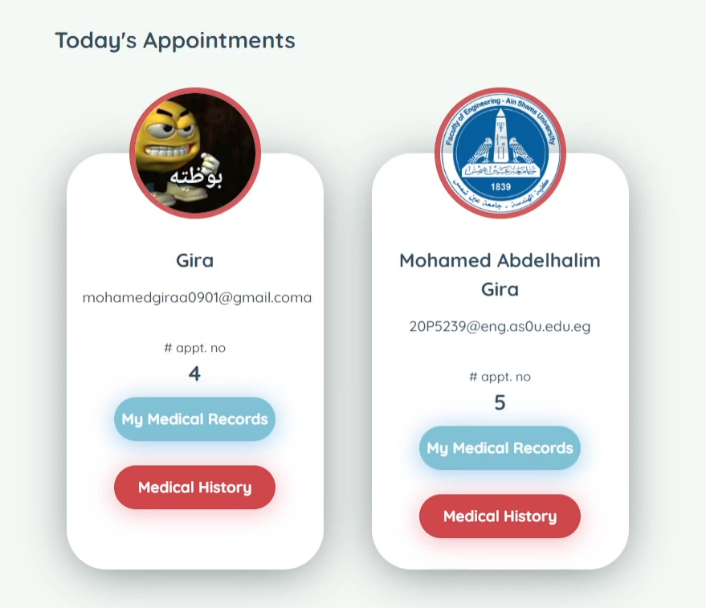

Furthermore, the doctor also can upload the diagnosis report for the
patient. The doctor also has the authority to preview the test result of
the patients and the other attachments related to the patient medical
profile as shown here:

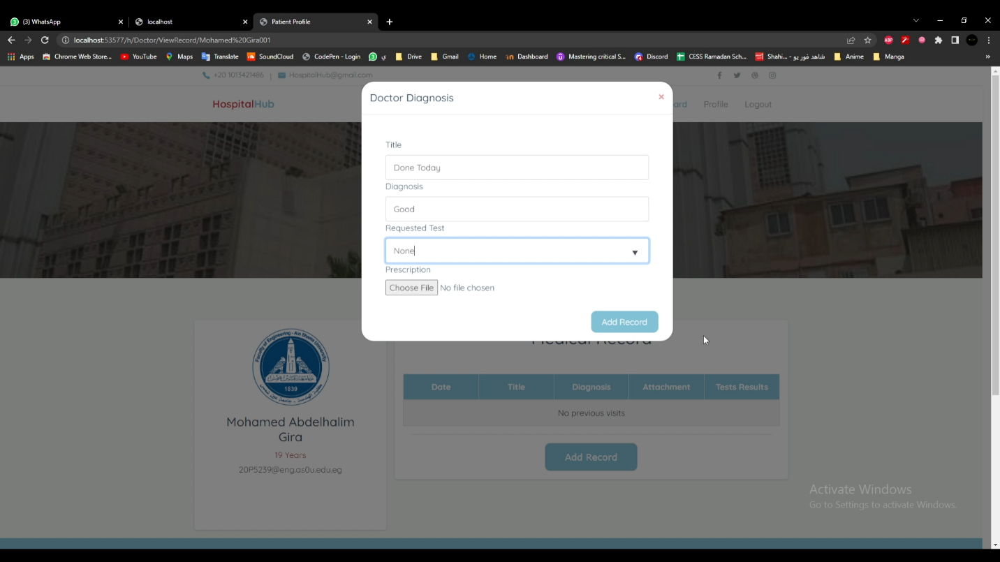 Each doctor
can view his profile, overall rating, and reviews[.]{dir="rtl"}

### Admin login

Admin can't register like normal patient or doctor. However, admin can
be added to the system by another system's administrator. The
administrator with higher authority can add other admins to the system,
as not all admins have the same level of authority to make it more
organized.

One of the admin functionalities is that he/she can add or remove
doctors or specialties from the hospital system.

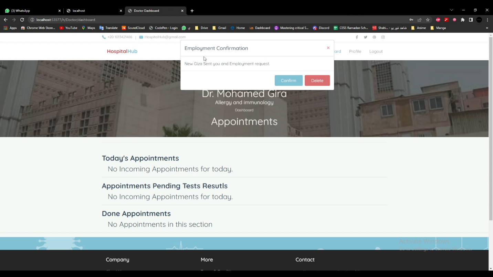 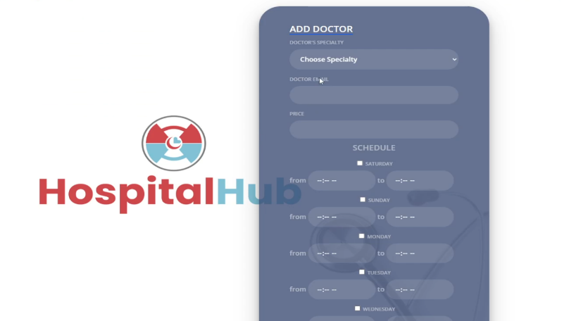 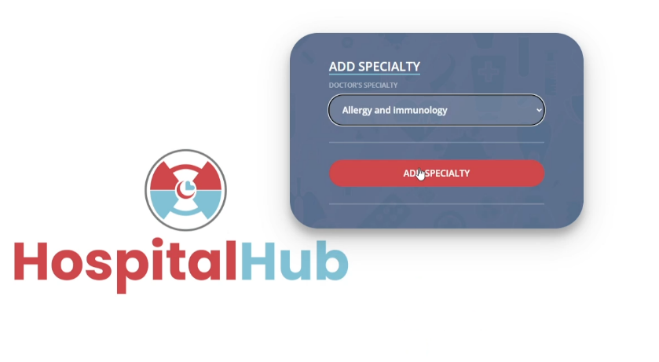 The added doctor will receive a
notification telling him that there is a request from the hospital
authority to add him/her to the system. If the doctor accepted the
request, the admin could add him/her to a specialty now with the
clinical appointments.

Note that admin can also remove doctors from the system, but the system
will open a window for the admin to show him/her the appointments that
this doctor has, and it may affect the system if this doctor removed.

### Owner page

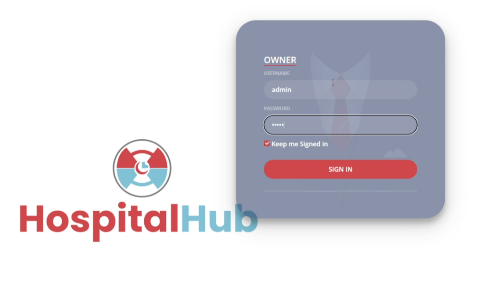 One of the main components in the system
is the owner.

The owner can control the main system parts and organize it.

The owner can get his credentials from the website creators. He can use
these credentials to sign into the system and perform his duties.

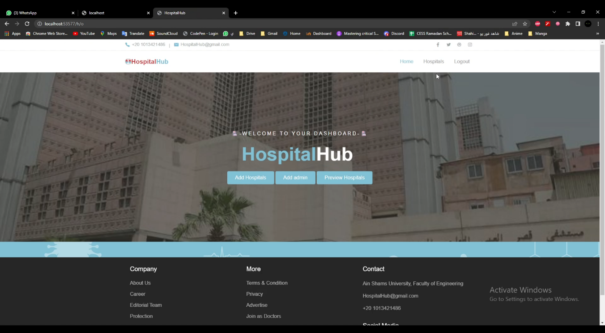 This image shows the main functionalities
the owner has.

The owner can remove any hospital from the hospital system as shown.
When an owner removes a hospital from the hospital system, all its
specialties will be cancelled and all doctors in it will updated as
unemployed in the system.

The owner has the ability to manage the hospitals as a whole but he
can't change the doctors' appointments or specialties as they aren't
from his authorities.

While adding a new hospital to the system, the owner must add an
administrator for this hospital.

## Finally

Here's some Hospital example accounts.

| **Hospital** | **El-zahraa**                 |                     |
| ------------ | ----------------------------- | ------------------- |
| **Admin**    | Username: Zahrawy             | Password: 123456789 |
| **Doctor**   | Username: Mohamed Gira        | Password: 12345     |
| **Doctor**   | Username: Mohamed Rizk        | Password: 12345     |
| **Doctor**   | Username: Mohamed Yasser      | Password: 12345     |
| **Doctor**   | Username: Farah Tharwat       | Password: 12345     |
| **Doctor**   | Username: Peter Azmy          | Password: 12345     |
| **Doctor**   | Username: Anas Salah          | Password: 12345     |
| **Doctor**   | Username: Abdelrahman Soliman | Password: 12345     |
| **Doctor**   | Username: Abdelrahman Sayed   | Password: 12345     |

Patients accounts

| **Username: farah** | **Password: admin** |
| ------------------- | ------------------- |

Owner accounts:

| **Username: admin** | **Password: admin** |
| ------------------- | ------------------- |

---

- You can create new hospitals and their admin via the owner account
  by signing in in "/h/o" URL mentioned above.

- Feel free to register as new patient, or doctor. these are just
  pre-created data to make the judgment process easier

- You can access the entire database of the system using "/admin" url
  and signing in with username: admin , password: admin .

- Enjoy :) .

## Conclusion

This application was designed, reviewed, and implemented successfully,
it fulfilled its aim to facilitate communications between patients and
doctors.

This web application was developed using **html, CSS, JavaScript,
python, and SQLite**. The choice for web\
app was convenient as it will facilitate the communication between
patients and hospitals, and will have a lot of Realtime features, in
addition, its more convenient for a patient to user an online website to
book an appointment instead of installing a specific software. **Other
Resources was used** such as external libraries in both front and
backend fields as writing in pure programming languages with no external
libraries or frameworks can be considered as reinventing the wheel, the
website functionalities were focused upon, and its scalability is now no
impossible task. The following frameworks and technologies were be used:
**Django, bootstrap, SQLite, lucid** for diagrams**, GitHub** for
version control and collaboration**.**
